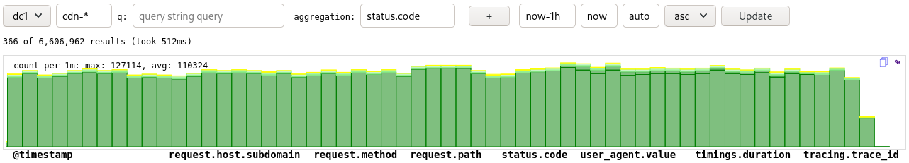

# es-stream-logs

Streams logs from elasticsearch, controllable via query parameters.
Loads (much) faster than Kibana, queries can be generated easily.

Example queries:

- http://localhost:3028/logs?aggregation_terms=level
- http://localhost:3028/logs?application_name=api&level=ERROR,WARN&aggregation_terms=level
- http://localhost:3028/logs?aggregation_terms=status.code&logger_name=TracingServletFilter&application_name=api
- http://localhost:3028/logs?aggregation_terms=status.code&percentiles_terms=timings.duration&logger_name=TracingServletFilter&application_name=api
- http://localhost:3028/logs?index=cdn-*&aggregation_terms=status.code
- http://localhost:3028/logs?index=cdn-*&status.category=5xx&from=now-1d&aggregation_terms=status.code
- http://localhost:3028/logs?timings.duration=>5000&from=now-1h&fields=,timings.duration
- http://localhost:3028/aggregation.svg?index=cdn-*&status.category=5xx&from=now-1d&aggregation_terms=status.code
- http://localhost:3028/raw?index=cdn-*&status.category=5xx&from=now-1d&aggregation_terms=status.code

See <http://localhost:3028> for complete docs and examples.

## Configuration

See [config.json](./config.json) for examples of all of the following.

- `default_endpoint`, `endpoints`, `indices`: set up elasticsearch
    endpoints and indices to display
- `queries`: configure queries to be displayed on the start page for
    quick access
- `field_format`: customize the formatting for a given field, e.g. to
    display a field as a link to an application that provides additional
    details
- `default_fields`: configure a set of fields to use by default for a
    given query, for example fields specific to `my-app` when there is a
    filter like `app=my-app`

## Development

Use `./scripts/run` to fetch dependencies and start the server.  Then
visit <http://localhost:3028>.  Set `ES_USER` and `ES_PASSWORD` in `.env`,
otherwise basic auth credentials will be requested to connect to
elasticsearch.

## License

This project is licensed under the [MIT License](./LICENSE).
